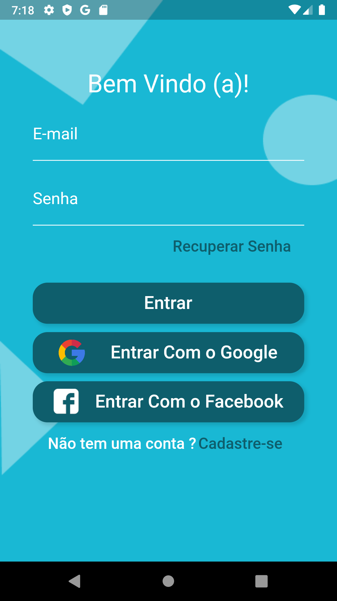
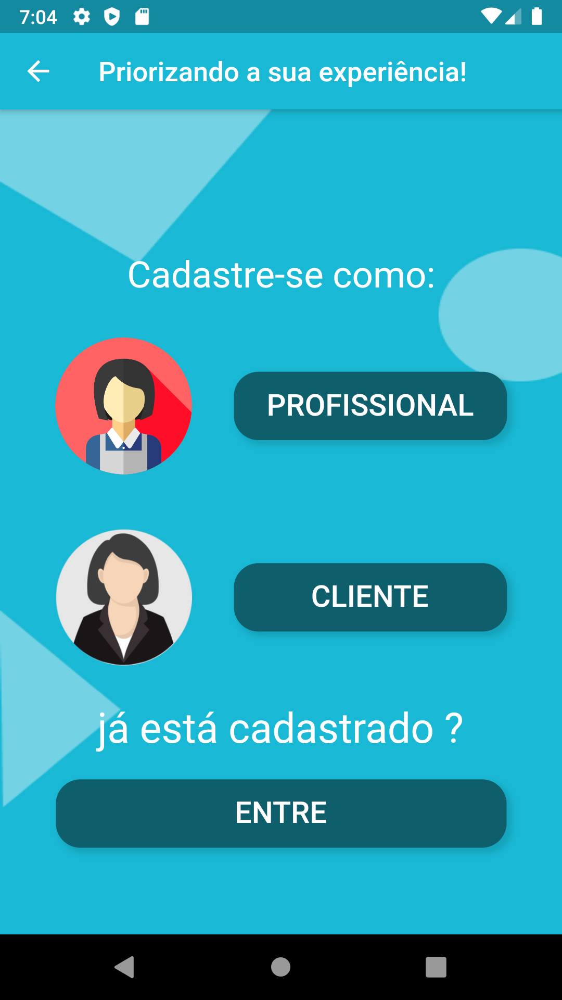
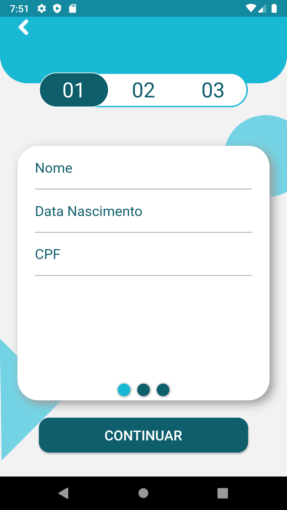
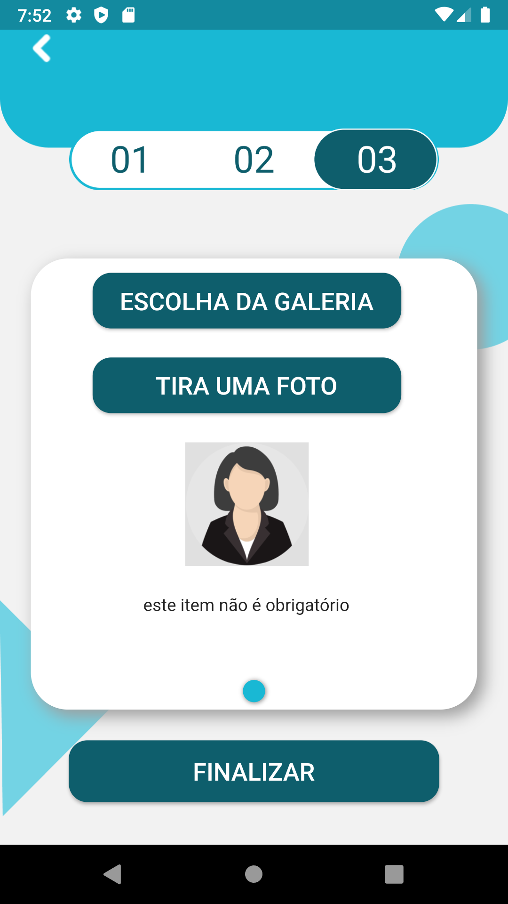
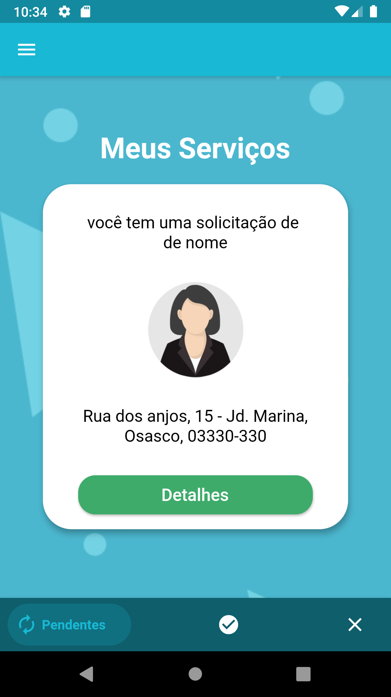
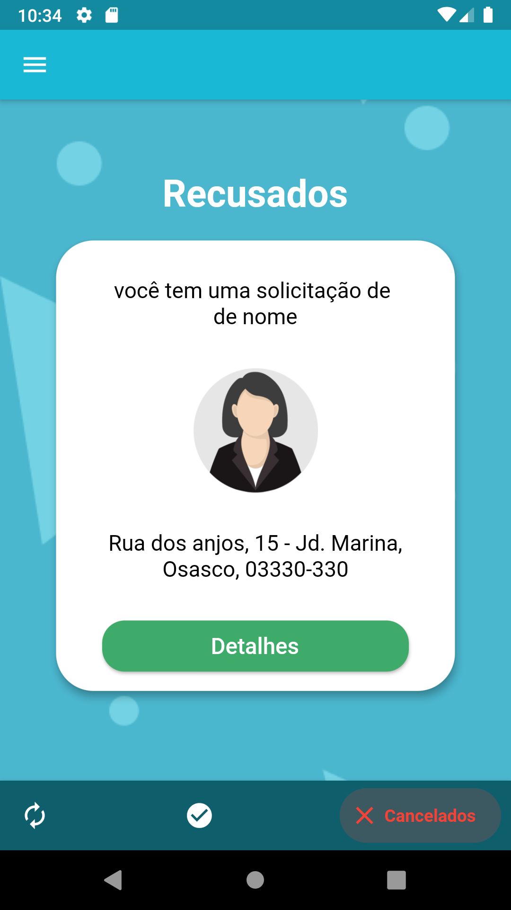

# CleanHouse
<!-- 

 -->

Uma aplicação feita com Flutter.

este projeto esta sendo construido para o tcc do curso desenvolvimento de sistemas no senai.
## Sobre o projeto
clean house é um aplicativo que visa intermediar e ligar pessoas que desejam realizar
serviços com pessoas que desejam trabalhar em serviços domésticos.
onde os usuários irão se cadastrar como cliente para solicitar serviços ou como profissionais para fazer serviços

  
  
  
  

Profissionais podem rejeitar ou aceitar pedidos

  
  

