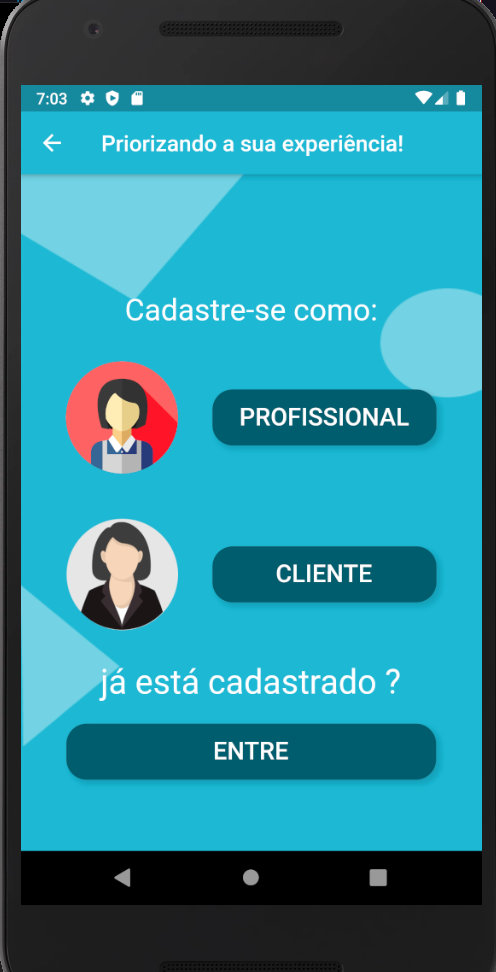
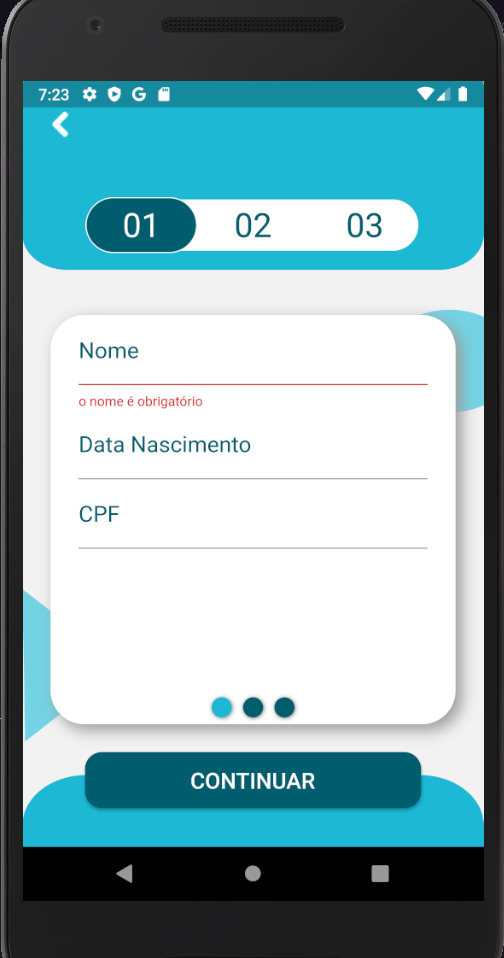
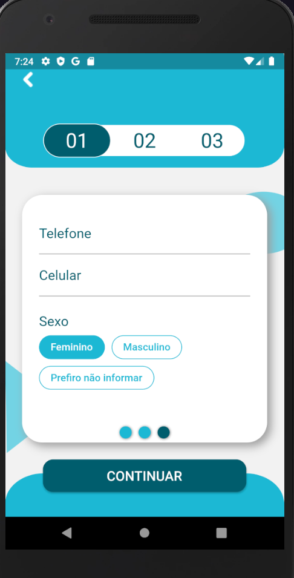
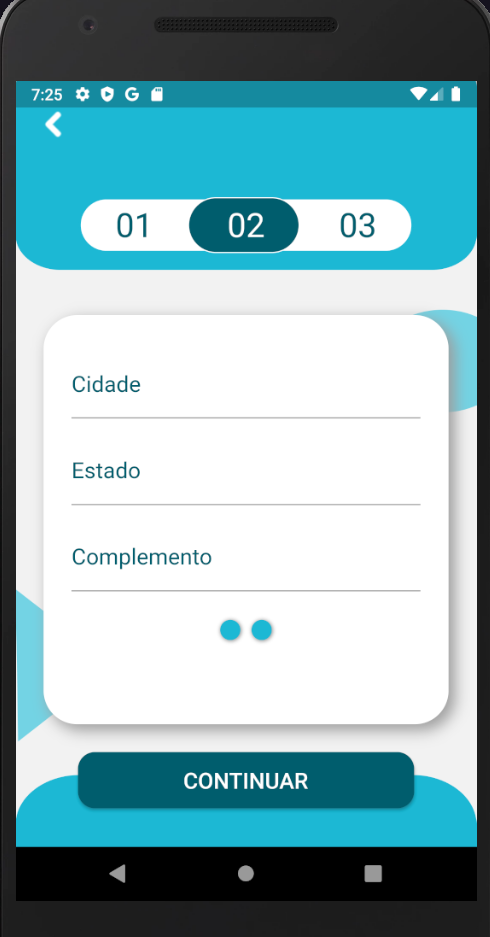
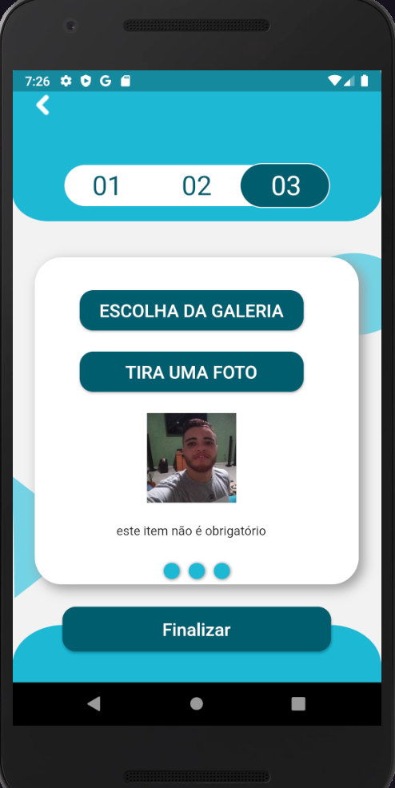

# clean_house

Uma aplicação feita com Flutter.

este projeto esta sendo construido para o tcc do curso desenvolvimento de sistemas no senai.
## Sobre o projeto
clean house é um aplicativo que visa intermediar e ligar pessoas que desejam realizar
serviços com pessoas que desejam trabalhar em serviços domésticos.

